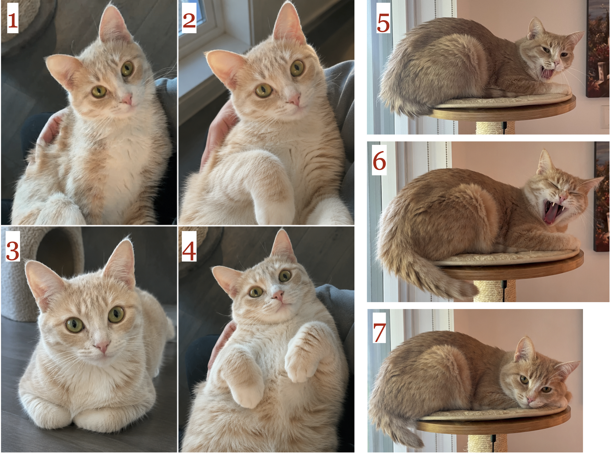
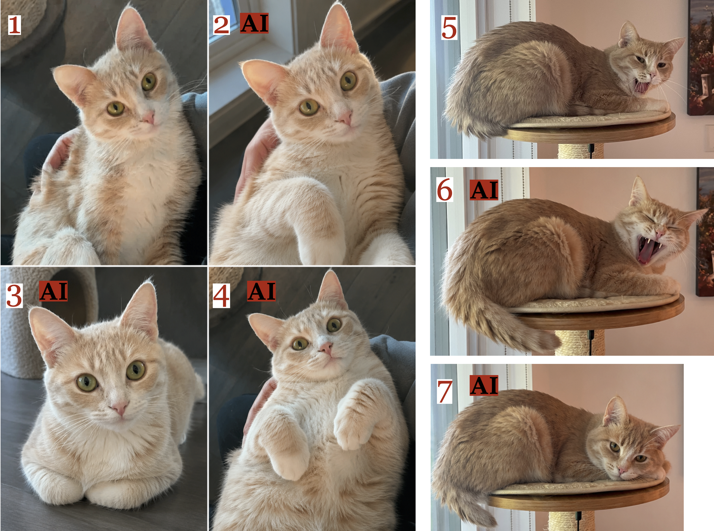
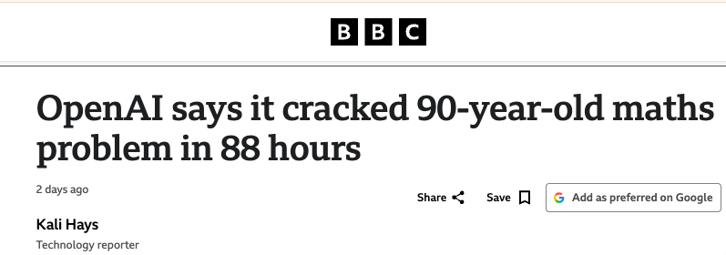
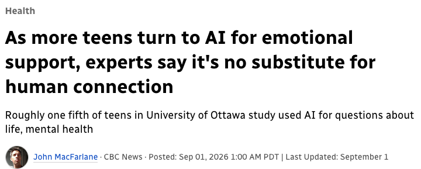
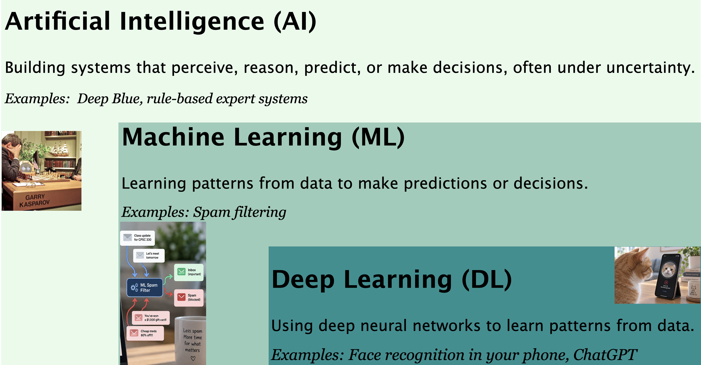
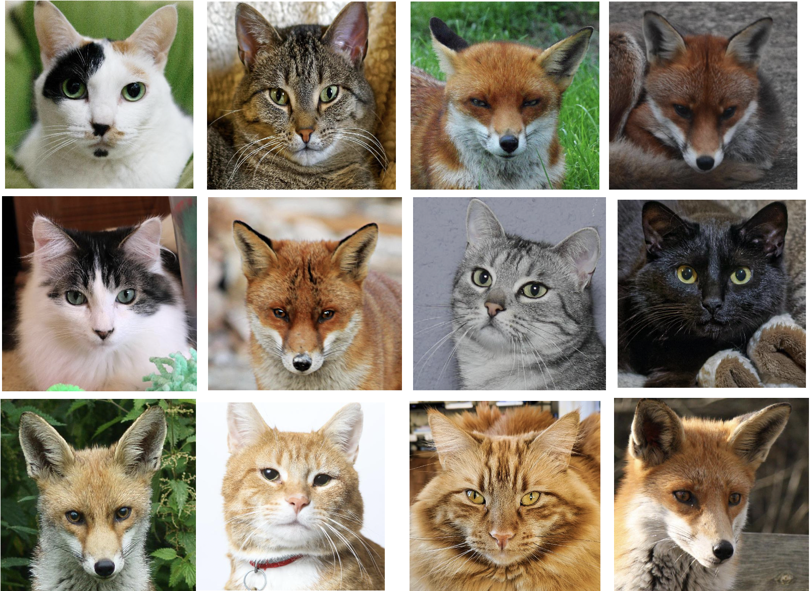
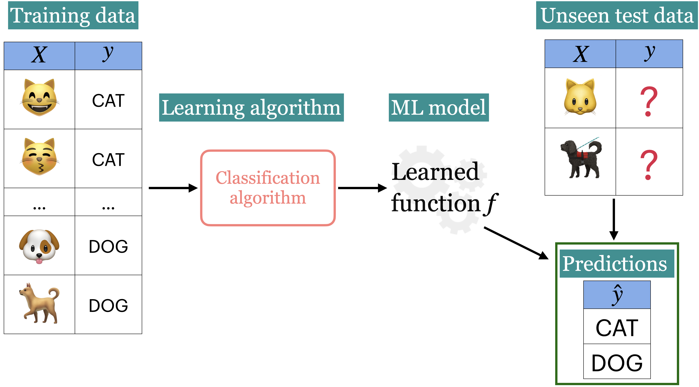
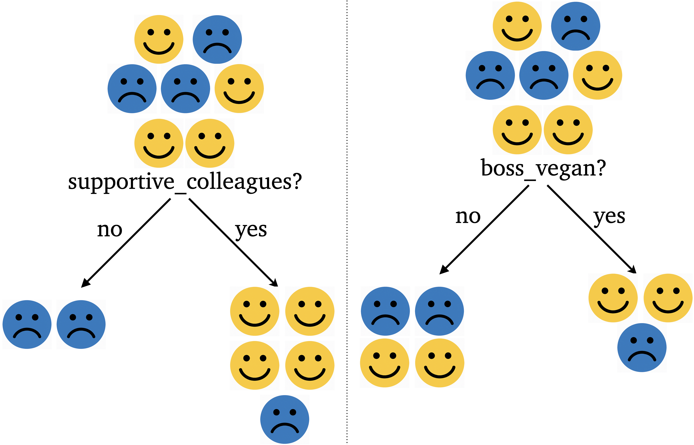

```{python}
#| include: false
from pathlib import Path
import sys

import numpy as np
import pandas as pd
import matplotlib.pyplot as plt
from IPython.display import HTML, display
from sklearn.dummy import DummyClassifier
from sklearn.tree import DecisionTreeClassifier, plot_tree

sys.path.insert(0, str(Path('code').resolve()))
from lecture_02_visuals import show_jobs, show_tree, show_boundary

from plotting_functions import *

plt.rcParams.update({'font.size': 16, 'figure.dpi': 150})
toy_happiness_df = pd.read_csv('data/toy_job_happiness.csv')
toy_regression_happiness_df = pd.read_csv('data/toy_job_happiness_regression.csv')
```

## Focus on the breath!

{.nostretch fig-align="center" width="500px"}

## Announcements

<!-- Add DSCI 571 announcements here. -->

## Today’s big questions {.slide-goals}

- What is machine learning, and when is it useful?
- How do we represent a prediction problem with features and a target?
- How do baselines and decision trees learn and make predictions?
- How do we evaluate predictions and control tree complexity?

## DSCI 571 course materials

- [Course notes](https://ubc-mds.github.io/DSCI_571_sup-learn-1_book/)
- [Lecture slides](../lecture.qmd)
- This course focuses on supervised learning, preprocessing, and building machine learning pipelines.

<!-- Add the current DSCI 571 syllabus, assessment information, and course platform links when available. -->

# 🤝 Introductions 🤝 {.middle}

## Meet your instructor {.smaller}

:::: {.columns}

::: {.column width="20%"}

:::

::: {.column width="80%"}
- Varada Kolhatkar [[ʋəɾəda kɔːlɦəʈkər](https://en.wikipedia.org/wiki/International_Phonetic_Alphabet)]
- You can call me Varada, **V**, or **Ada**.
- Associate Professor of Teaching in the Department of Computer Science.
- Ph.D. in Computational Linguistics at the University of Toronto. 
- I primarily teach machine learning courses in the [Master of Data Science (MDS) program](https://masterdatascience.ubc.ca/). 
- Contact information
    - Email: kvarada@cs.ubc.ca
    - Office: ICCS 237
:::

::::

## Meet Eva (a fictitious persona)!

:::: {.columns}

::: {.column width="40%"}

:::

::: {.column width="60%"}
Eva is among one of you. She has some experience in Python programming. She knows machine learning as a buzz word. During her recent internship, she has developed some interest and curiosity in the field. She wants to learn what is it and how to use it. She is a curious person and usually has a lot of questions!  
:::

::::

## Activity 1 {.slide-your-turn}
\
Discuss the following questions with your neighbour. 

- What's your name and background?
- Where have you encountered machine learning?
- What would you like to get out of this course?
- What's one thing you're excited or unsure about?

# AI in everyday life

## Original vs AI? {.smaller}

Which cats do you think are AI-generated? 



## Original vs AI? {.smaller}

How did you decide?

 

## AI in the news {.smaller}

:::: {.columns}

::: {.column width="50%"}

**[Mathematical discovery](https://www.bbc.com/news/articles/cy7zygy3rl2o):** 

OpenAI reports an AI-generated solution to a major problem about fluid motion. 

**[Emotional support](https://www.cbc.ca/news/health/ai-teenagers-mental-health-study-9.7327227):** 

About one in five students in an Ontario study reported seeking emotional support from AI. The association with emotional problems does not establish causation. 
:::
:::{.column width="50%"}



:::
::::

**What would you want to know before trusting an AI system in either setting?**

::: {.notes}
Maybe: How accurate is it? How was it tested? Who checked the answer? What data was it trained on? What happens when it's wrong? Who is accountable?

Exactly.

And notice that the answers may be different in different contexts.

For mathematics, perhaps we can formally verify part of an argument. But people still have to decide whether the formal statement actually corresponds to the original mathematical problem and whether the result is significant.

For emotional support, the questions are quite different. What evidence do we have that this is safe? For whom? What happens in a crisis? What information is being collected? Who is responsible?
:::

## Which of these do you think use AI? {.slide-your-turn}

- A spam detector 📧
- Autocomplete on your phone 📱
- A basic calculator ➕
- Finding the closest holiday destination by straight-line distance 🛫
- Predicting traffic conditions tomorrow 
- Recommending a holiday destination you would enjoy 🛳️
- A chatbot planning your holiday 💬

**What makes you call something AI?** 

::: {.notes}
Invite explanations rather than seeking a single correct label for every example. Calculators and straight-line distance calculations are usually considered ordinary computation. Route-finding can illustrate classical AI search, although shortest-path algorithms also belong to general computer science. Spam detection, autocomplete, traffic prediction, and recommendations can use learned models, explicit rules, or combinations. A holiday-planning chatbot can combine a language model with a calculator to total costs, web search to find opening hours, and route search to plan travel. Ask which parts of its work each component handles. Determinism alone does not exclude a system from AI. Use the ambiguity to motivate the next slide's distinction between AI, ML, and DL, without requiring students to know those terms yet.
:::

# AI, ML, and DL

## What are AI, ML, and DL?

{.nostretch fig-align="center" height="400px"}

Our focus: learning from examples and applying what we learn to new cases.

:::{.notes}
Imagine a self-driving car. To drive safely, the system needs to perceive what's around it—is there a pedestrian? Where are the other cars? It needs to reason about what it perceives—if there's a pedestrian in front of me, what should I do? And then it needs to act—perhaps slow down or stop.

These are examples of capabilities we often associate with AI: perception, reasoning, planning, and decision-making.

But AI doesn't necessarily mean machine learning. We can build AI systems using explicit rules, search, machine learning, or combinations of these approaches.

Chess gives us a nice historical example. IBM built a chess-playing system called Deep Blue. Deep Blue relied heavily on search: it could examine enormous numbers of possible chess positions and evaluate which moves looked promising. A human chess player can't possibly search through that many possibilities.

In 1997, Deep Blue defeated Garry Kasparov, who was the reigning world chess champion.

So AI is broader than machine learning. Machine learning is one way of building systems with intelligent capabilities—and that's the approach we're mainly interested in in DSCI 571.
:::

# How ML works

## Image classification {.smaller}
Searching photos for animals involves **image classification**. Imagine telling cats and foxes apart. How might we do this with traditional programming? With ML?

:::: {.columns}

::: {.column width="35%"}
 
:::

::: {.column width="65%"}

| Image ID | Whiskers Present | Ear Size  | Face Shape | Fur Color  | Eye Shape   | Label |
|----------|------------------|-----------|------------|------------|-------------|-------|
| 1        | Yes              | Large     | Round      | Mixed      | Round       | Cat   |
| 2        | Yes              | Medium    | Round      | Brown      | Almond      | Cat   |
| 3        | Yes              | Large     | Pointed    | Red        | Narrow      | Fox   |
| 4        | Yes              | Large     | Pointed    | Red        | Narrow      | Fox   |
| 5        | Yes              | Small     | Round      | Mixed      | Round       | Cat   |
| 6        | Yes              | Large     | Pointed    | Red        | Narrow      | Fox   |
| 7        | Yes              | Small     | Round      | Grey       | Round       | Cat   |
| 8        | Yes              | Small     | Round      | Black      | Round       | Cat   |
| 9        | Yes              | Large     | Pointed    | Red        | Narrow      | Fox   |

::: 
::::

## Who writes the rules?

:::: {.columns}
::: {.column width="48%"}
**Traditional programming**

We write the rules.

**Pointed face + red fur + narrow eyes**

↓

Predict **fox**
:::
::: {.column width="48%"}
**Machine learning**

We provide labeled examples.

**Features + cat/fox labels**

$\to$

Learn a **prediction rule**
:::
::::

::: {.fragment}
**What would happen with either approach if we encountered a fox with white fur?**
:::

::: {.notes}
In the example table, fur colour helps distinguish the classes, while whiskers do not because every animal has them. These patterns need not hold for all cats and foxes. ML can learn rules, too; the distinction is whether we specify the prediction rule ourselves or learn it from examples. Both approaches need evaluation on new cases.
:::

## DL approach: example 

:::: {.columns}

::: {.column width="40%"}
 
:::

::: {.column width="60%"}
- A neural network automatically learns which features to look at (edges $\rightarrow$ textures $\rightarrow$ objects).
- No need to even specify face shape or fur colour. It learns relevant features on its own. 
::: 

::::

## Ways of learning from data {.smaller}

- **Supervised learning:** predict targets from labeled examples
- **Unsupervised learning:** discover structure without supplied targets
- **Reinforcement learning:** learn actions through interaction and rewards
- **Generative AI:** generate content; models can use several learning approaches
- **Recommendation systems:** learn preferences, often combining multiple approaches

These categories are not mutually exclusive.


## Supervised learning: inputs, targets, and predictions {.smaller}

- **Inputs ($X$):** observations described by features, such as fur colour and ear size.
- **Targets ($y$):** labels or values we want to predict, such as cat or fox.
- **Training:** learn a model $f$ relating inputs to targets.
- **Prediction:** use the model to predict targets for unseen examples.

{.nostretch fig-align="center" height="280px"}

# When should we use ML?

## Rules, ML, or human judgment? {.smaller}

| Starting point | When it is appropriate |
|---|---|
| **Explicit rules** | The logic is known, stable, and can be stated precisely. |
| **Machine learning** | Useful patterns exist in representative data, hand-written rules are difficult, and we can evaluate errors. |
| **Human judgment** | Context, empathy, values, or accountability are central to the decision. |

Real systems can combine all three. Making a prediction does not automatically justify delegating the decision to a model.


## ❓❓ Rules, ML, or human judgment? {.smaller .slide-your-turn}

Choose a starting point for each problem and explain why. Combinations are possible.

- **(A)** Checking whether an email address ends with `@student.ubc.ca`
- **(B)** Awarding a scholarship based on a student's personal essay
- **(C)** Predicting which songs a listener might enjoy
- **(D)** Checking whether two essays are exactly identical
- **(E)** Tagging photos of friends

Where could mistakes cause harm, and who should be responsible?

::: {.notes}
Suggested starting points: A and D use explicit rules; C and E use ML; B requires accountable human judgment. ML could assist parts of B, but predicting a score does not settle who deserves a scholarship. Exact matching in D is only one narrow check, not a complete plagiarism detector.
:::

# Formulate a prediction problem

## Which job might make you happy? 

You've graduated and have several job offers. **Which one would make you happiest?**

You decide to look for patterns in the experiences of friends who value similar things in a job.

{.nostretch fig-align="center" width="600px" fig-alt="Happy vs sad employees"}

<center><small>Image created by GPT-6 Astra</small></center>

::: {.notes}
Invite two or three suggestions before showing the data. This is an invented teaching dataset, not evidence about what causes happiness. We are predicting a reported outcome, not choosing a job on someone's behalf.
:::

## What do we need to know? {.slide-your-turn}

Before thinking about machine learning, let's define the prediction problem.

- **Problem**: Help someone choose a job they'll be happy in.
- **What things about a job might affect how happy you are with it?**
- **What exactly should we predict? How could we represent it?**

::: {.notes}
Frame ML as a tool for solving a problem. First clarify the decision we want to support, then define a prediction that could help.

Ask aloud: "Would this prediction actually help someone make their decision?" Predicting happiness can inform a job choice, but does not make the decision for the person.

For the target, students might suggest Happy/Unhappy, 1/0, or a numerical satisfaction score. Use their suggestions to emphasize that what the target represents matters. Encoding Happy as 1 and Unhappy as 0 does not turn the problem into regression.

The numerical satisfaction target is hypothetical; it is not in our dataset.

This sequence describes supervised ML; unsupervised tasks do not have a designated prediction target.
:::

## Toy job happiness dataset

```{python}
show_jobs(toy_happiness_df)
```

Each row describes one person in a job. **1 = yes; 0 = no.**

::: {.notes}
Read one row aloud. The chapter applies the same concepts to quiz grades; this lecture uses job happiness so we can inspect all seven examples. The boss_vegan column is an arbitrary candidate feature, not a claim about diet and happiness.
:::

## Recap: the goal of supervised learning

Use examples with known **features $X$** and **targets $y$** to learn a mapping function **$f$**.

$$
\underbrace{X_{\text{new}}}_{\text{features}}
\xrightarrow{\text{learned model } f}
\underbrace{\hat{y}_{\text{new}}}_{\text{predicted targets}}
$$

**The goal:** predict targets accurately for **new examples**.

::: {.notes}
The model approximates the relationship between features and targets; it need not reproduce every training label perfectly. Explain that y is a known target and y-hat is a model prediction. Now ask students to identify X and y in the job dataset.
:::

## Your turn: identify $X$ and $y$ {.slide-your-turn}

```{python}
show_jobs(toy_happiness_df.head(3))
```

First three examples: **which columns are inputs, and which is the target?**

::: {.fragment}
**Features $X$:** the four job attributes \
**Target $y$:** `Happy?`\
**Example:** one row \
$n = 7$ examples and $d = 4$ features
:::

::: {.notes}
The first row is outlined and the target column is shaded. Ask students to identify each role before revealing the labels. Features need to be available when making a prediction; the unknown answer cannot also be an input.
:::

## Training vs. Prediction 

- Training: learn the mapping
  - Known features $X$ + known targets $y$ $\to$ fitted model $f$

- Prediction: use the mapping

  - New features $X_{\text{new}}$ $\to$ fitted model $f$ $\to$ predictions $\hat{y}_{\text{new}}$

**We need known targets to train the model, not to make predictions.**

::: {.notes}
Training is also called fitting. In the job example, training uses job attributes and known happiness labels. For a new job, we supply its attributes to the fitted model; the happiness label is unknown. A prediction is the model's proposed answer and may differ from the actual target. Known targets are also needed to evaluate prediction accuracy.

Optional reminder: unsupervised learning has no designated target—for example, grouping similar jobs by their attributes. Ask whether grouping jobs requires happy? labels; the answer is no.
:::

## Same job features, different targets {.smaller}

```{python}
show_jobs(toy_regression_happiness_df.head(3))
```

- **Happy or unhappy** $\to$ predict a discrete label $\to$ **classification**
- **Happiness score from 0 to 100** $\to$ predict a numerical quantity $\to$ **regression**

Other regression examples: predicting temperature, house price, or travel time.

## iClicker 1.1: Classification or regression? {.slide-your-turn}


**Select all regression problems.**

- **A.** Predict whether a flight will be delayed.
- **B.** Predict a flight's delay in minutes
- **C.** Predict a student's percentage grade in DSCI 571.
- **D.** Predict whether you'll get a seat on the bus.
- **E.** Predict whether you'll hit snooze tomorrow morning.

# Train, predict, and evaluate models using `scikit-learn`

## [`scikit-learn`](https://scikit-learn.org/stable/)

- In this part of the course we use a framework called `scikit-learn`.
- A popular framework for tabular data 
- Easy to use. 
- 67.3K stars on Github 


## Separate the inputs from the target

```{python}
#| echo: true
X = toy_happiness_df.drop(columns=['happy?'])
y = toy_happiness_df['happy?']
```

| Object | Contains | Shape |
|---|---|---|
| `X` | Four feature values for each person | `(7, 4)` |
| `y` | One known happiness label per person | `(7,)` |

**Keep the answer out of the inputs.**

## Your turn: predict without the features {.slide-your-turn}

{.nostretch width="320px" fig-align="center" fig-alt="Seven training labels: four Happy and three Unhappy"}

If you must predict **the same label for everyone**, which label should you choose? How many predictions will be correct?

::: {.notes}
Allow 30–45 seconds before advancing. Ask for both a label and a count. This introduces the most-frequent baseline before any library code.
:::

## A baseline gets four out of seven right

```{python}
baseline_labels = np.repeat('Happy', len(y))
show_jobs(pd.DataFrame({'Actual': y, 'Baseline prediction': baseline_labels,
                       'Correct?': np.where(y == baseline_labels, 'Yes', 'No')}))
```

**Always predict Happy:** accuracy $= 4/7 \approx 57\%$\
**Classification error:** $3/7 \approx 43\% = 1 - \text{accuracy}$

::: {.notes}
A baseline gives us a reference point. Getting some predictions right does not establish that a model has learned anything useful from the job attributes.
:::

## Fit a baseline with scikit-learn

```{python}
#| echo: true
from sklearn.dummy import DummyClassifier

dummy = DummyClassifier(strategy='most_frequent')
dummy.fit(X, y);
```

**`fit(X, y)`** learns from the training data.

Here, it finds the most frequent target. **This baseline ignores the feature values.**

::: {.notes}
Scikit-learn calls model objects estimators. Introduce the library in the context of this task rather than opening its homepage. DummyClassifier receives X for a consistent API even though this strategy does not use its values.
:::

## Predict, then check accuracy

```{python}
#| echo: true
dummy.predict(X)
```

```{python}
#| echo: true
print(f'Training accuracy: {dummy.score(X, y):.1%}')
```

**`predict(X)`** returns predicted labels.\
**`score(X, y)`** compares predictions with known targets.

::: {.notes}
For this classifier, score returns accuracy. We are scoring the data used for fitting, so this is training accuracy. We have not measured performance on new people.
:::

## 

| Method | You provide | It does |
|---|---|---|
| **`fit(X, y)`** | Features and known targets | Learns the model |
| **`predict(X_new)`** | Features | Returns predicted targets |
| **`score(X, y)`** | Features and known targets | Returns a default evaluation measure |

**Why doesn't `predict` require `y`?** 

::: {.fragment}
We don't know the answer yet!
:::

::: {.notes}
For classifiers used here, score is accuracy. Regressors usually return R²; score does not always mean accuracy. For supervised evaluation, known targets are needed to judge the predictions. Prediction and evaluation can be separate uses of a fitted model, not mandatory consecutive steps on the same examples.
:::

# Decision trees 

## Can we do better than the baseline? {.slide-your-turn}

```{python}
show_jobs(toy_happiness_df)
```

**Propose one yes/no question that separates Happy from Unhappy.** 

::: {.notes}
Invite rules involving supportive_colleagues or salary. Unlike the baseline, these rules use feature values. A decision tree learns a hierarchy of questions from the data.
:::

## Which question is more effective? {.slide-your-turn}
::: panel-tabset
### Visual
:::: {.columns}
::: {.column width="40%"}

:::
::: {.column width="60%"}
| Question | No group | Yes group | Comments|
|---|---|---|---|
| Supportive colleagues? | 0 😊, <br>2 ☹️ | 4 😊,<br>1 ☹️ | Cleaner split|
| Boss vegan? | 2 😊,<br>2 ☹️ | 2 😊,<br>1 ☹️ | Mixed labels| 
:::
::::
### Data {.smaller}

```{python}
show_jobs(toy_happiness_df)
```
:::


::: {.fragment}
**Supportive colleagues** gives a cleaner split. 
:::


## What are we trying to learn? 

- We want to learn which questions to ask and in what order.
- How many different combinations of feature-based questions could a decision tree potentially ask?


```{python}
show_jobs(toy_happiness_df)
```

## Decision tree Training (high level)

- Training a decision tree is a search process: we look for the "best" tree among many possible ones.
- There are different algorithms for learning trees. [Check this out.](https://scikit-learn.org/stable/modules/tree.html#tree-algorithms-id3-c4-5-c5-0-and-cart) 
- At each step, we evaluate candidate questions using measures such as:
  - Information gain
  - Gini index
- The goal is to split the data into groups with greater certainty (more homogeneous outcomes).

::: {.notes}
For classification, measures such as Gini impurity or entropy quantify class mixture. No formulas are needed here. Numeric features do not need to be binarized: a tree can learn salary <= 75000. A leaf predicts its most frequent training class. This is a sequence of **local choices**; it does not guarantee the best possible whole tree.
:::


## Fit a decision tree

```{python}
#| echo: true
from sklearn.tree import DecisionTreeClassifier

model = DecisionTreeClassifier(max_depth=2, random_state=1)
model.fit(X, y);
```

**Same `fit` interface. A different learning algorithm.**

`max_depth=2` allows at most two questions along a prediction path.

::: {.notes}
random_state makes the example reproducible. Leave the parameter/hyperparameter distinction until students have seen what this model learned.
:::


## Read the learned tree {.smaller}

```{python}
#| echo: false
from sklearn.tree import plot_tree
plot_tree(model, filled=True, feature_names = X.columns, class_names=["Happy", "Unhappy"], impurity = False, fontsize=10);
```
**Root:** first question, **Branch:** answer to a question, **Leaf:** prediction

::: {.notes}
At each question, True goes left and False goes right. For a 0/1 feature, supportive_colleagues <= 0.5 means no supportive colleagues. Internal nodes ask questions; leaves return the majority label. Here the algorithm selected salary first, although supportive colleagues was better than boss_vegan in our earlier comparison.
:::

<!-- ## Read the learned tree {.model-plot}

```{python}
#| fig-width: 11
#| fig-height: 4.5
#| out-width: 95%
#| fig-alt: 'The root splits salary at 75000. Low salary predicts Unhappy; higher salary splits on supportive colleagues, predicting Happy only when colleagues are supportive.'
show_tree(model, X.columns)
```

**Root:** first question · **Branch:** answer to a question · **Leaf:** prediction

::: {.notes}
At each question, True goes left and False goes right. For a 0/1 feature, supportive_colleagues <= 0.5 means no supportive colleagues. Internal nodes ask questions; leaves return the majority label. Here the algorithm selected salary first, although supportive colleagues was better than boss_vegan in our earlier comparison.
:::
-->


## Prediction  {.model-plot .boundary-plot}
What would be the prediction for the example below using this tree ? 

:::: {.columns}

::: {.column width="70%"}
```{python}
nodes = plot_tree(
    model, filled=True,
    feature_names=X.columns,
    class_names=["Happy", "Unhappy"],
    impurity=False, fontsize=10,
)

for node in nodes:
    node.set_text("\n".join(
        line for line in node.get_text().splitlines()
        if not line.startswith("samples =")
    ))
```
:::
::: {.column width="30%"}

- supportive_colleagues = 0
- salary = 100,000
- coffee_machine = 0
- vegan_boss = 1  
:::
::::

## Prediction with `sklearn`

- supportive_colleagues = 0
- salary = 100,000
- coffee_machine = 0
- vegan_boss = 1  

```{python}
#| echo: true
test_example = [[0, 100000, 0, 1]]
print("Model prediction: ", model.predict(test_example))
```

## Does the tree beat the baseline?

```{python}
#| echo: true
model.score(X, y)
```

```{python}
comparison = pd.DataFrame({
    'Model': ['Always Happy', 'Decision tree (max_depth=2)'],
    'Correct / total': [f'{(dummy.predict(X) == y).sum()} / {len(y)}',
                        f'{(model.predict(X) == y).sum()} / {len(y)}'],
    'Training accuracy': [f'{dummy.score(X, y):.0%}', f'{model.score(X, y):.0%}'],
})
show_jobs(comparison)
```

::: {.fragment}
**Yes, on the training data.**\
We still don't know how well it predicts happiness for new people.
:::

::: {.notes}
Ask students what the word training contributes to the claim. Do not introduce a full train/test workflow yet; that is the central question for Lecture 2.
:::

## iClicker Check-in {.slide-your-turn}


**How are you feeling about the workflow and decision trees?**

- **A.** I can explain both to a neighbour.
- **B.** I understand the ideas but need to review the code.
- **C.** I understand the code but need to review how decision trees work.
- **D.** I'd benefit from a pause and another example.

::: {.notes}
Use the response to choose a brief pause or revisit one prediction. This is a confidence check, not a scored content question.
:::

## Parameters vs. Hyperparameters 

| Before `fit`: **hyperparameters** | During `fit`: **parameters** |
|---|---|
| We set `max_depth=2`. | The tree learns to split on `salary` at **75,000**. |
| This limits the allowed tree depth. | It learns another split on `supportive_colleagues` at **0.5**. |

::: {.fragment}
**Tree depth:** the number of edges on the longest root-to-leaf path.
:::

::: {.notes}
Leaf predictions are also learned from the data. Hyperparameters can later be selected using validation; for now, emphasize that they are supplied before fitting. A maximum depth is a limit, not a guarantee of exactly that depth.
:::


## Decision boundary 

- A **decision boundary** is the line, curve, or surface that separates classes.
- Points on one side $\rightarrow$ Model predicts Class Happy  
- Points on the other side $\rightarrow$ Model predicts Class Unhappy

## Decision boundary with `max_depth=1` {.model-plot .boundary-plot .smaller}

- **Points:** observed people and their actual labels
- **Shaded regions:** the model's predicted class
- **Decision boundary:** where the predicted class changes

```{python}
X_subset = X[["supportive_colleagues", "salary"]]
model = DecisionTreeClassifier(max_depth=1, random_state=1)
model.fit(X_subset.values, y)
plot_tree_decision_boundary_and_tree(
    model, X_subset, y, x_label="supportive_colleagues", y_label="salary", fontsize=12, class_names = ["Happy", "Unhappy"]
)
```

## Decision boundary with `max_depth=1` {.model-plot .boundary-plot .smaller}

```{python}
X_subset = X[["supportive_colleagues", "salary"]]
model = DecisionTreeClassifier(max_depth=1, random_state=1)
model.fit(X_subset.values, y)
plot_tree_decision_boundary_and_tree(
    model, X_subset, y, x_label="supportive_colleagues", y_label="salary", fontsize=12, class_names = ["Happy", "Unhappy"]
)
```

A depth-one tree is called a **decision stump**. A shallow tree can stop too soon. Which person does this tree get wrong?

::: {.fragment}
The person earning **$150,000 without supportive colleagues**.
:::

## Decision boundary with `max_depth=2` {.model-plot .boundary-plot}

Contrast it with the depth-two tree, which can ask another question within the higher-salary group.

```{python}
X_subset = X[["supportive_colleagues", "salary"]]
model = DecisionTreeClassifier(max_depth=2, random_state=1)
model.fit(X_subset.values, y)
plot_tree_decision_boundary_and_tree(
    model, X_subset, y, x_label="supportive_colleagues", y_label="salary", fontsize=12, class_names = ["Happy", "Unhappy"]
)
```


<!-- ## A shallow tree can stop too soon {.model-plot .compact-tree}

```{python}
#| fig-width: 11
#| fig-height: 3.4
#| out-width: 92%
#| fig-alt: 'A depth-one tree splits salary at 75000 and predicts Happy for all higher salaries, including one Unhappy training example.'
stump = DecisionTreeClassifier(max_depth=1, random_state=1).fit(X, y)
show_tree(stump, X.columns)
```

```{python}
print(f'Training accuracy: {stump.score(X, y):.1%} (6 of 7 correct)')
```

**Which person does this tree get wrong?**

::: {.fragment}
The person earning **$150,000 without supportive colleagues**.
:::

::: {.notes}
A depth-one tree is called a decision stump. Contrast it with the depth-two tree, which can ask another question within the higher-salary group.
:::
-->


<!--
## Decision regions: depth 1 {.model-plot .boundary-plot}

```{python}
#| fig-width: 11
#| fig-height: 4.7
#| out-width: 94%
#| fig-alt: 'Depth-one decision regions: a salary threshold of 75000 separates predicted Unhappy from Happy. One Unhappy person at salary 150000 lies in the Happy region.'
X_two = X[['supportive_colleagues', 'salary']]
boundary_stump = DecisionTreeClassifier(max_depth=1, random_state=1).fit(X_two, y)
show_boundary(boundary_stump, X_two, y)
```

**Salary $\leq 75,000$:** predict Unhappy. Otherwise: predict Happy.

## Decision regions: depth 2 {.model-plot .boundary-plot}

```{python}
#| fig-width: 11
#| fig-height: 4.7
#| out-width: 94%
#| fig-alt: 'Depth-two regions: low salaries predict Unhappy; above 75000, only supportive colleagues predict Happy. All seven training points match their predicted regions.'
boundary_tree = DecisionTreeClassifier(max_depth=2, random_state=1).fit(X_two, y)
show_boundary(boundary_tree, X_two, y)
```

**Above $75,000:** now ask whether the colleagues are supportive.

::: {.notes}
Keep attention on the upper region: only that region receives another split. Both panels use identical axes and colours. For this toy dataset the extra split corrects the remaining training error. More detailed regions do not establish better predictions for unseen people.
:::
-->

## iClicker 1.3: Baselines and trees {.slide-your-turn}


**Select all true statements.**

- **A.** Changing salary values must change a most-frequent baseline's predictions.
- **B.** `predict` needs features; `score` also needs known targets.
- **C.** Decision-tree features must be binary.
- **D.** A tree predicts by following a path from root to leaf.

::: {.notes}
The same labeled training examples are assumed in A; changing features alone does not change the majority label. Ask students to explain why C is false using the salary split.
:::

## Exit ticket {.model-plot .boundary-plot .smaller}

A new job offers **$100,000**, **supportive colleagues = 1**, and **free coffee**.

:::: {.columns}

::: {.column width="70%"}
```{python}
nodes = plot_tree(
    model, filled=True,
    feature_names=X.columns,
    class_names=["Happy", "Unhappy"],
    impurity=False, fontsize=10,
)

for node in nodes:
    node.set_text("\n".join(
        line for line in node.get_text().splitlines()
        if not line.startswith("samples =")
    ))
```
:::
::: {.column width="30%"}

1. What path and prediction does it get?
2. Name one learned parameter and one hyperparameter.
3. Does 100% training accuracy make this prediction reliable?
:::
::::


::: {.notes}
Allow one to two minutes individually or in pairs. The absent boss_vegan value does not prevent hand-tracing this tree, because that feature never appears in it; calling predict with the original fitted estimator would still require the full feature schema.
:::

## Next: will it work on new examples? {.slide-summary}

We can now represent a problem with **$X$ and $y$**, compare against a **baseline**, and **fit and read a decision tree**.

**A model can get every training example right.\
What would convince us it has learned something useful?**

Lecture 2: evaluating on unseen data, overfitting, and model complexity.

More details on this material: [DSCI 571 course notes](https://ubc-mds.github.io/DSCI_571_sup-learn-1_book/)

::: {.notes}
Additional topics in the course notes: terminology across disciplines, prediction versus statistical inference, DummyRegressor and DecisionTreeRegressor, and further decision-boundary examples. Here inference means applying a fitted model when used operationally; statistical inference asks about population quantities or relationships and their uncertainty. Prediction does not by itself establish causation.
:::

